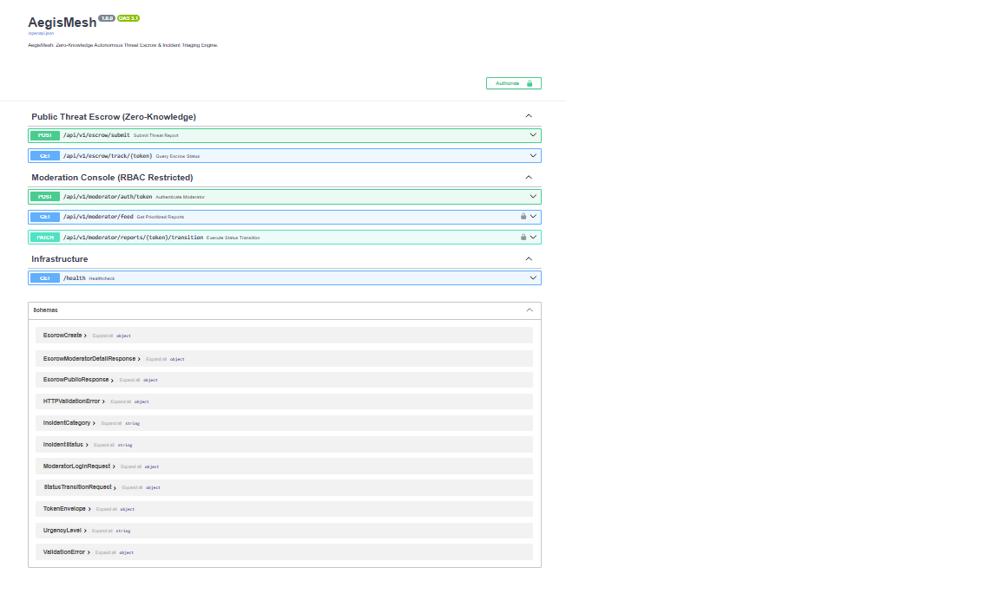
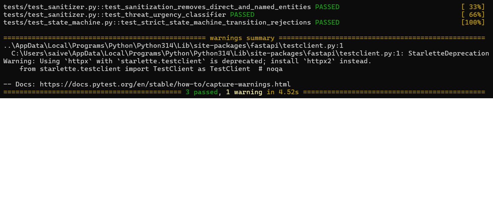

# AegisMesh - Zero-Knowledge Autonomous Threat Escrow & Incident Triage Backend

> Built for the Google Developer Groups (GDG) on Campus SRM Technical Recruitment 2026-27 (Backend Domain - Task 1: Whistle Drop).

[](https://fastapi.tiangolo.com)
[](https://python.org)
[]()
[](LICENSE)

---

## 🌐 Overview & Core Architecture
AegisMesh solves the primary vulnerability present in conventional whistleblowing platforms: accidental self-incrimination through natural language narrative leakage. Whistleblowers frequently provide colloquial references, location data, or colleague names in unstructured text.

AegisMesh introduces an **in-memory, two-pass differential redaction pipeline** before any data touches the database:
1. **Direct Regex Stripping:** Eliminates email addresses, phone numbers, and direct communication handles.
2. **On-Device NLP Entity Recognition:** SpaCy NER model scrubs proper names (`[REDACTED_PERSON]`), physical locations (`[REDACTED_GPE]`), and institutions (`[REDACTED_ORG]`).
3. **Autonomous Urgency Triaging:** Incident narratives are analyzed deterministically to calculate threat severity and rank triage queues for moderators (`CRITICAL`, `ELEVATED`, `STANDARD`).
4. **CSPRNG Case Tokens:** Cryptographically unguessable tracking codes (`AEGIS-XXXX-XXXX-XXXX-XXXX`) generated via Python's `secrets` module prevent report enumeration attacks.
5. **Deterministic State Machine (FSM):** Enforces strict report life cycles (`SUBMITTED` ➔ `UNDER_REVIEW` ➔ `RESOLVED` / `DISMISSED`) with `HTTP 409 Conflict` guards rejecting illegal state hops.

---

## 📸 Screenshots & Visual Proof

### 1. Interactive OpenAPI / Swagger Documentation


### 2. Passing Automated Test Suite (PyTest)


---

## 🔌 API Endpoints Reference

### Public Whistleblower Interface (Zero-Knowledge)
| Method | Route | Description |
| :--- | :--- | :--- |
| `POST` | `/api/v1/escrow/submit` | Anonymous report ingest (auto-sanitized & triaged) |
| `GET` | `/api/v1/escrow/track/{token}` | Verify report status using CSPRNG claim token |

### Moderator Portal (JWT Protected)
| Method | Route | Description |
| :--- | :--- | :--- |
| `POST` | `/api/v1/moderator/auth/token` | Authenticate moderator session |
| `GET` | `/api/v1/moderator/feed` | Priority-sorted feed filtered by status/category |
| `PATCH`| `/api/v1/moderator/reports/{token}/transition` | Validated FSM status transition |

**Default Moderator Credentials:**
- **Username:** `gdg_moderator`
- **Password:** `Aegis@SRM2026!`

---

## 🚀 Local Development Setup

```bash
# Clone the repository
git clone [https://github.com/saivenkatreddy30/aegis-mesh-backend.git](https://github.com/saivenkatreddy30/aegis-mesh-backend.git)
cd aegis-mesh-backend

# Initialize environment
python -m venv venv
.\venv\Scripts\activate  # On Linux/macOS: source venv/bin/activate

# Install dependencies and NLP model
pip install -r requirements.txt
python -m spacy download en_core_web_sm

# Launch server
uvicorn aegis.main:app --reload